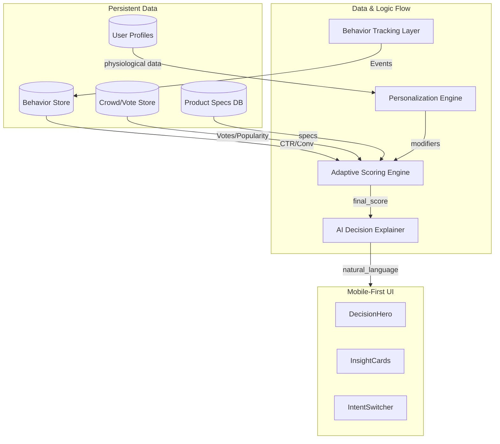

# Autonomous Decision Engine Architecture (v3)

## 1. System Architecture Diagram



## 2. Key Data Flow Explanation

1.  **Input Collection**: User physiological data (weight, experience) is collected via personalization forms or derived from past behavior.
2.  **Spec Scoring**: The core engine calculates baseline scores from technical product specs.
3.  **Personalization Modifier**: The `PersonalizationEngine` applies multipliers (0.8x - 1.5x) based on user-product fit (e.g., high cushioning for heavy runners).
4.  **Adaptive Weighting**: The `AdaptiveScoringEngine` merges Spec Scores with real-world Behavioral Data (which products actually convert) and Crowd Scores (votes).
5.  **AI Explanation**: The `AIExplainer` takes the final results and translates the numerical delta into human reasoning ("Why this fits YOU").
6.  **Growth Feedback**: Users vote or share rankings, which feed back into the `Crowd Store`, creating a self-optimizing loop.

## 3. Sample Scoring Logic (Combined)

```typescript
const specScore = 0.85; // engine v2 result
const pModifier = PersonalizationEngine.calculateModifier(product, userProfile); // 1.2x
const crowdScore = GrowthEngine.getPopularityScore(productId, votes); // 0.9

const finalScore = (specScore * pModifier * 0.7) + (crowdScore * 0.3);
```

## 4. Proprietary Data Moat

-   **Verified Decision Data**: We don't just know what users look at; we know which specs (Weight vs. Cushioning) drive actual "Buy" clicks for specific user types.
-   **Gear Lifespan Stats**: Tracking user "drop-off" points to predict when products wear out based on real usage.

## 5. Experimentation & A/B Testing

-   **Framework**: `src/features/experimentation/` handles random variant assignment.
-   **KPIs**: Conversion Rate (CTR on Buy CTA), Session Depth, and Accuracy of AI Explanations.

## 6. Example API Endpoints

-   `POST /api/v3/analytics/batch`: Receives `AnalyticsEvent[]` for behavior tracking.
-   `GET /api/v3/personalization/profile`: Retrieves or updates `UserProfile`.
-   `GET /api/v3/decision/recommend`: Returns `ComparisonResult` enhanced with `AIExplanation` and `AdaptiveModifiers`.
-   `POST /api/v3/growth/vote`: Records a product vote and updates the crowd score.

## 7. Example UI Data Contract (Natural Language Output)

```json
{
  "productId": "nike-af3",
  "whyForYou": "As a beginner, the Nike Alphafly 3 is your best choice because it offers the stability and injury protection our tests verify as essential for your level.",
  "whoNotFor": "You should avoid this model if you prioritize traction above all else; other models in this test lead by over 15%.",
  "confidence": 0.95
}
```
